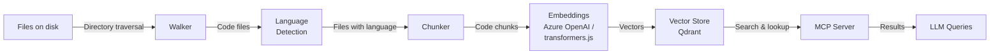

# Architecture

repolens is a codebase indexing system designed to prepare source code for LLM consumption. It extracts code symbols, embeds them, and serves them through an MCP server.

## Modules

- **cli**: Command-line interface (entry point, built on commander)
- **walker**: Walks a directory, honouring nested .gitignore files and skipping binary and oversized files
- **language**: Detects a file's language from its extension or shebang
- **chunker**: Breaks code into meaningful chunks (M2)
- **embeddings**: Converts text to vectors via Azure OpenAI or local transformers.js (M2)
- **store**: Vector database interface with Qdrant backend and in-memory implementation (M2)
- **mcp**: MCP server that exposes search and navigation to LLMs (M3)
- **graph**: Symbol graph for fast code navigation (M3)

## Data Flow

